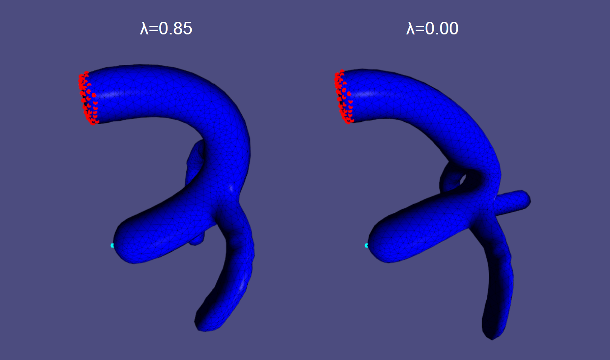
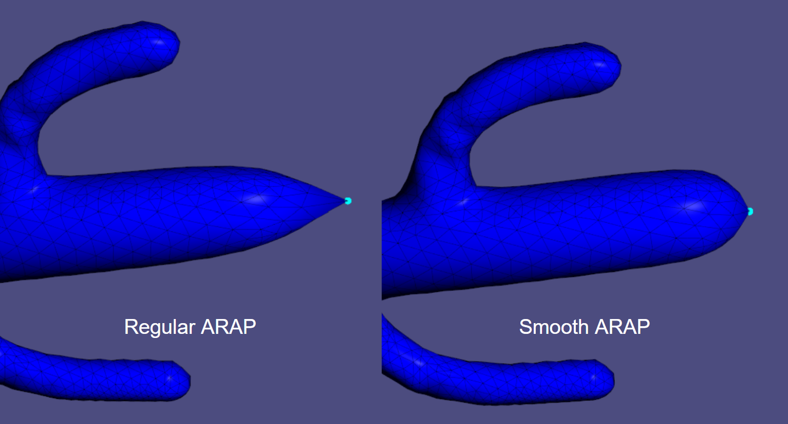
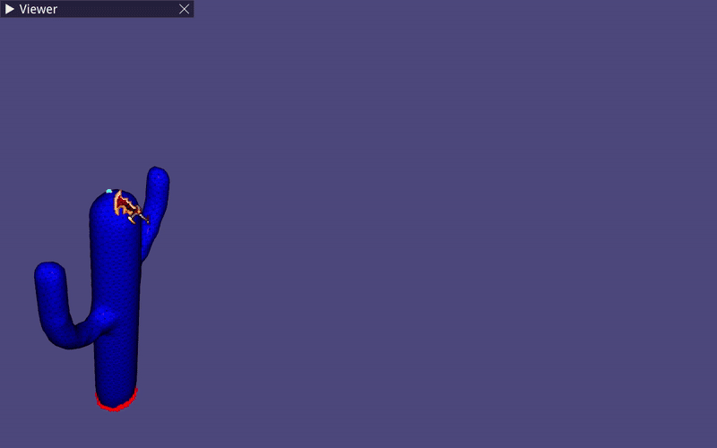

# ARAP Mesh Deformation

An interactive C++ implementation of standard As-Rigid-As-Possible deformation and its higher-order smooth extension.

I built this project as a way to learn more about geometry processing by implementing a complete deformation method instead of treating ARAP as a black box. I began with a simpler spokes-only ARAP implementation. After getting the local-global solver working, I extended the neighborhood definition to spokes-and-rims. Finally, I added the higher-order term proposed in Smooth ARAP to the same solver.

This is a learning-oriented implementation of existing methods rather than a proposal for a new deformation technique. The goal was to understand the mathematics well enough to translate it into a working interactive system, examine implementation details that are hidden when using an existing solver, and compare the standard and smooth formulations in the same application.

`libigl` is used for visualization, mesh loading, Voronoi mass matrix construction, polar SVD, and as a reference ARAP implementation. It is not used to assemble or solve the custom ARAP formulation.

<p align="center">
  
</p>

<p align="center">
  <em>
    Standard ARAP (λ = 0.00) and Smooth ARAP (λ = 0.85) under the same positional constraints and handle displacement.
  </em>
</p>

<p align="center">
  
</p>

<p align="center">
  <em>
    Smooth ARAP distributes the influence of an isolated point handle over a wider region, reducing the localized spike produced by standard ARAP.
  </em>
</p>

<p align="center">
  
</p>

<p align="center">
  <em>
    Per-vertex weighted energy during interactive deformation. Blue indicates lower local energy, while red indicates higher local energy.
  </em>
</p>

## Current status

The interactive deformation system is implemented and usable. It currently supports:

* custom spokes-and-rims ARAP;
* higher-order Smooth ARAP;
* a libigl spokes-and-rims baseline;
* point handles and fixed anchor vertices;
* interactive handle translation;
* adjustable local-global iteration count;
* adjustable smoothness parameter;
* ARAP, smooth, and weighted total energy evaluation;
* per-vertex energy visualization;
* runtime mesh loading;
* saving and loading handle/anchor configurations;
* OpenMP-parallel rotation fitting;
* deterministic benchmark runs with CSV export.

The project also includes a deterministic benchmark mode. It drives a predefined handle along a fixed 50-step trajectory, measures only the solver-related sections of the update, and appends the raw result to a CSV file. The benchmark results reported below are medians of 10 runs.

## Motivation

I began with a spokes-only version of standard ARAP because I wanted to understand the complete local-global optimization process: how cotangent weights are constructed, how rotations are fitted for vertex neighborhoods, how the global system is assembled, and how positional constraints are introduced into a sparse solve.

Once the initial solver was working, I changed the neighborhood formulation to spokes-and-rims. This gave each vertex a larger local region containing both the edges connected directly to it and the opposite edges of its incident triangles.

After completing the standard spokes-and-rims formulation, I wanted to explore how the method could be extended. Point handles in standard ARAP can produce sharp changes or spike-like artifacts because constraints are applied to individual vertices. This led me to the Smooth ARAP formulation by Oehri, Herholz, and Sorkine-Hornung, which adds a higher-order term based on Laplacian vectors.

I added this term to the existing solver instead of implementing it as a separate application. This allowed me to reuse the same mesh representation, constraints, interface, and local-global pipeline while directly observing how the additional term changes the deformation.

Keeping standard ARAP, Smooth ARAP, and the libigl reference implementation in the same project also provides a useful basis for checking correctness and comparing their behavior under the same conditions.

## Method overview

The solver follows the standard local-global ARAP optimization strategy.

For each iteration:

1. Fit one rotation per vertex using the current deformed mesh.
2. Assemble the right-hand side from the rotated original geometry.
3. Apply positional constraints.
4. Solve a sparse linear system for the new vertex positions.
5. Repeat for the selected number of iterations.

The previous deformed state is reused as the initialization during interactive dragging.

### Spokes-and-rims neighborhoods

The current implementation uses spokes-and-rims neighborhoods.

For a vertex $v$, its local region contains every directed edge belonging to a triangle incident on $v$. This includes:

* **spokes**, which are directly connected to $v$
* **rims**, which are the opposite edges of incident triangles.

Each triangle contributes all three of its half-edges to the local region of each of its vertices.

For a half-edge $e$, let

$$
c_e=\cot(\alpha_e),
$$

where $\alpha_e$ is the angle opposite the half-edge.

The `HalfEdge` structure stores:

* the source and destination vertices;
* the raw cotangent coefficient $c_e$;
* the original weighted edge vector $c_e\mathbf e$.

The half-cotangent coefficient used to assemble the Laplacian, global right-hand side, and ARAP energy is

$$
w_e=\frac{c_e}{2}
=\frac{1}{2}\cot(\alpha_e).
$$

This information is precomputed whenever a mesh is loaded.

### Cotangent Laplacian

The positive semidefinite cotangent Laplacian is assembled explicitly from triangle half-edges.

For each half-edge $e=(i,j)$, the corresponding triangle contributes its half-cotangent coefficient

$$
w_e=\frac{1}{2}\cot(\alpha_e)
$$

to the following entries:

$$
L_{ii}\mathrel{+}=w_e,\qquad
L_{jj}\mathrel{+}=w_e,\qquad
L_{ij}\mathrel{-}=w_e,\qquad
L_{ji}\mathrel{-}=w_e.
$$

Interior edges receive contributions from both adjacent triangles, while boundary edges receive one contribution.

Cotangent values are calculated directly from the original vertex positions. Negative cotangent coefficients are not clamped.

### Local step

For each vertex $v$, a covariance matrix is constructed over its spokes-and-rims region:

$$
S_v=
\sum_{e\in\mathcal N_v}
c_e\mathbf e{\mathbf e'}^T,
$$

where $\mathbf e$ is an original edge, $\mathbf e'$ is its current deformed version, and $c_e=\cot(\alpha_e)$ is the raw cotangent coefficient.

Using $w_e=c_e/2$ instead would scale the entire covariance matrix by the same positive constant and would therefore produce the same fitted rotation.

The closest rotation $R_v\in SO(3)$ is recovered using polar SVD. Rotation fitting is independent for every vertex, so this part of the local step is parallelized with OpenMP.

Only mesh edges are used during rotation fitting. The Laplacian vectors introduced by the smooth term are not included in the covariance matrix.

### Standard ARAP global step

With rotations fixed, the ARAP energy becomes quadratic in the unknown vertex positions:

$$
E_{\mathrm{ARAP}}=
\sum_v
\sum_{e\in\mathcal N_v}
\frac{w_e}{3}
\left\|
\mathbf e'-R_v\mathbf e
\right\|^2,
$$

where

$$
w_e=\frac{1}{2}\cot(\alpha_e).
$$

The factor $1/3$ compensates for the overlap of spokes-and-rims neighborhoods.

For every triangle, the implementation averages the rotations of its three vertices. The averaged rotation is then used with the triangle half-edges to assemble the global right-hand side $b$.

The standard ARAP global step solves:

$$
LV'=b,
$$

subject to the active handle and anchor constraints.

When the smoothness parameter is zero, this is the system used by the custom solver.

### Smooth ARAP term

Let $\widetilde M^{-1}$ denote the normalized inverse Voronoi mass matrix. The area-corrected Laplacian vectors of the original mesh are:

$$
\ell=\widetilde M^{-1}LV.
$$

For an individual vertex $v$:

$$
\ell_v=
\left(\widetilde M^{-1}LV\right)_v.
$$

The additional smooth energy measures the difference between the Laplacian vector of the deformed mesh and the rotated original Laplacian vector:

$$
E_{\mathrm{smooth}}=
\sum_v
\widetilde A_v
\left|
\ell'_v-R_v\ell_v
\right|^2,
$$

where $\widetilde A_v$ is the reciprocal of the corresponding normalized inverse mass.

The combined objective is:

$$
E=
(1-\lambda)E_{\mathrm{ARAP}}
+
\lambda E_{\mathrm{smooth}},
\qquad 0\leq\lambda<1.
$$

With rotations fixed, the global system becomes:

```math
\left[
(1-\lambda)L
+
\lambda L^T\widetilde{M}^{-1}L
\right]V'
=
(1-\lambda)b
+
\lambda L^T\mathcal{R}.
```

where row $v$ of $\mathcal R$ contains the original area-corrected Laplacian vector rotated by $R_v$.

The application represents the smoothness parameter as an integer between `0` and `99`, which is converted internally using:

```cpp
double lambda_adjusted=lambda/100.0;
```

The inverse Voronoi masses are divided by their mean before the system is assembled. This keeps the relative scale of the ARAP and smooth terms more manageable across meshes with different dimensions and tessellations.

### Edge-only rotation fitting

Rotations are fitted only to mesh edges, even when the smooth term is enabled.

It is also possible to include Laplacian vectors in the SVD fitting step. However, the Smooth ARAP paper reports that this can introduce unintuitive rotations and worse convergence behavior. This implementation therefore follows the proposed edge-only approach.

Because the local step does not optimize the complete smooth objective with respect to rotations, a strictly monotonic decrease of the total energy is not theoretically guaranteed when $\lambda>0$.

### Positional constraints

Anchors and the active handle are enforced as exact positional constraints.

The constraints are applied through substitution:

1. Vertices marked as anchors and the currently dragged handle are identified as fixed.
2. Their influence is subtracted from the right-hand side of the free vertices.
3. Matrix entries connecting fixed and free vertices are removed from the solve.
4. Constrained rows are replaced with identity rows.
5. The resulting sparse matrix is factorized using `Eigen::SimplicialLDLT`.

The factorization is computed when a drag session begins. It is also recomputed when the smoothness parameter changes because changing $\lambda$ changes the left-hand side matrix.

During handle movement, the factorization is reused while only the right-hand side and target handle position change.

## Energy evaluation

The application evaluates three values for the current deformation:

* raw ARAP energy;
* raw smooth energy;
* weighted total energy.

The displayed total energy is:

$$
E_{\mathrm{total}}=
(1-\lambda)E_{\mathrm{ARAP}}
+
\lambda E_{\mathrm{smooth}}.
$$

The raw smooth energy is still evaluated when $\lambda=0$. In that case, it acts only as a diagnostic measurement and contributes zero to the total objective.

Before energy evaluation, rotations are refitted using the latest vertex positions. This ensures that the displayed values correspond to the current deformation.

Per-vertex weighted energy is mapped to a blue-red color scale:

* blue indicates lower local energy;
* red indicates higher local energy.

The `Color factor` control changes only the visualization scale. It does not affect the solver or the energy itself.

Energy evaluation and color updates can be disabled through the interface when they are not needed.

## Interaction

The application initially loads:

```text
meshes/cactus_highres.off
```

Another triangle mesh can be selected at runtime through the file dialog.

Supported formats are:

* `.off`
* `.obj`
* `.ply`

### Vertex modes

| Mode               | Behavior                            |
| ------------------ | ----------------------------------- |
| `None`             | Drag an existing handle             |
| `Handle Selection` | Mark free vertices as handles       |
| `Anchor Selection` | Mark free vertices as fixed anchors |
| `Handle Removal`   | Remove marked handles               |
| `Anchor Removal`   | Remove marked anchors               |

Vertex colors used during selection are:

* cyan — handle;
* red — anchor;
* green — selectable free vertex.

Multiple vertices can be marked as handles. However, only the handle currently being dragged is included as an active positional constraint. All anchors remain fixed at their original positions.

### Solver controls

| Control             | Description                                                 |
| ------------------- | ----------------------------------------------------------- |
| `Iterations`        | Number of local-global iterations performed for each update |
| `Smoothness factor` | Sets $\lambda$ from `0.00` to `0.99`                        |
| `Custom ARAP`       | Uses the custom standard or Smooth ARAP solver              |
| `libigl ARAP`       | Uses libigl spokes-and-rims ARAP as a baseline              |
| `Show energy`       | Enables energy calculation and local energy coloring        |
| `Color factor`      | Changes only the energy heatmap scale                       |

The smoothness parameter affects only the custom solver. Selecting `libigl ARAP` uses the standard spokes-and-rims implementation provided by libigl.

### Other controls

* `Open Mesh` loads another triangle mesh.
* `Reset Vertices` removes all handle and anchor selections.
* `Reset Mesh` restores the original vertex positions while keeping the current selections.
* `Save Vertices` stores the current handle and anchor indices in `config.txt`.
* `Load Config` restores the stored selection for the current mesh.
* `Start benchmark` runs the predefined 50-step benchmark for a supported test configuration and appends its measurements to `benchmark_results.csv`.

The configuration file stores vertex selections, not deformed mesh geometry. Configurations are identified using the mesh filename without its extension.

## Building

### Requirements

* C++17 compiler
* CMake 3.16 or newer
* OpenMP
* OpenGL-capable system
* internet connection during the first CMake configuration

The project uses CMake `FetchContent` to download:

* [libigl 2.5.0](https://github.com/libigl/libigl/tree/v2.5.0)
* [ImGuiFileDialog 0.6](https://github.com/aiekick/ImGuiFileDialog/tree/v0.6)

Eigen, GLFW, OpenGL, and ImGui are provided or configured through libigl.

Clone the repository:

```bash
git clone https://github.com/luka4723/ARAP.git
cd ARAP
```

### Windows with Ninja

The project has primarily been developed and tested on Windows 11 using MSVC and Ninja.

Run the following commands from Developer PowerShell or another terminal in which MSVC is available:

```powershell
cmake -S . -B build -G Ninja -DCMAKE_BUILD_TYPE=Release
cmake --build build
.\build\ARAP.exe
```

### Windows with Visual Studio

```powershell
cmake -S . -B build
cmake --build build --config Release
.\build\Release\ARAP.exe
```

### Linux

The standard CMake build process is:

```bash
cmake -S . -B build -DCMAKE_BUILD_TYPE=Release
cmake --build build -j
./build/ARAP
```

Platform-specific OpenGL, GLFW, and OpenMP development packages may be required.

After compilation, the `meshes` directory is copied next to the executable.

## Project structure

| File                   | Purpose                                                                           |
| ---------------------- | --------------------------------------------------------------------------------- |
| `main.cpp`             | Viewer and application initialization                                             |
| `mesh_context.h/.cpp`  | Mesh state, precomputation, Laplacian systems, constraints, and energy evaluation |
| `cell.h/.cpp`          | Half-edge data and per-vertex rotation fitting                                    |
| `solver.h/.cpp`        | Local-global iterations, right-hand side assembly, and mouse-to-plane projection  |
| `point_manager.h/.cpp` | Vertex picking and handle/anchor editing                                          |
| `menu.h/.cpp`          | ImGui controls, viewer callbacks, benchmark driver, and CSV export                |
| `meshes/`              | Meshes used for interactive testing                                               |

The code is intentionally kept relatively small so that the complete deformation pipeline can be followed without navigating a large framework.

## Benchmarks

The benchmark is started from the viewer, but the measured deformation interval contains only the solver call. Rendering, energy coloring, mesh upload, interface handling, and CSV output are outside the reported deformation time.

Each test uses a predetermined mesh, handle, anchor configuration, initial state, and target trajectory. The handle is translated to its final position in 50 equal steps. At every step, the selected number of local-global iterations is executed, using the result of the previous step as the initialization.

Every configuration was run 10 times in a Release build, and the median is reported. Timings are measured with `std::chrono` and expressed in milliseconds. The final ARAP energy is evaluated after the last trajectory step. Raw measurements are appended to `benchmark_results.csv`.

The custom implementation was measured with OpenMP restricted to either one or eight threads. The libigl baseline was run serially. The custom and libigl tests use the same spokes-and-rims energy, constraints, target trajectory, initialization, and iteration count. `lambda = 0` is used when the two implementations are compared.

The solver uses a fixed iteration count instead of a convergence threshold. The results therefore compare equal computational workloads and do not make time-to-convergence claims.

### Test system

* CPU: Intel Core Ultra 7 255HX
* Operating system: Windows 11
* Compiler: MSVC 19.50.35717
* Build configuration: `Release`
* OpenMP threads: 1 and 8 for the custom solver
* libigl version: `2.5.0`

### Test meshes

| Mesh | Vertices | Benchmark role | Source |
| --- | ---: | --- | --- |
| Cactus | 1,856 | Small test mesh | [ARAP project meshes](https://igl.ethz.ch/projects/ARAP/) |
| Dino | 14,070 | Medium test mesh | [ARAP project meshes](https://igl.ethz.ch/projects/ARAP/) |
| Armadillo | 172,974 | Large-mesh stress test | [Stanford 3D Scanning Repository](https://graphics.stanford.edu/data/3Dscanrep/) |

### Mesh provenance

The benchmark meshes are third-party assets and were not created as part of this project:

* **Cactus** and **Dino** were downloaded from the “Meshes used in the paper” archive accompanying Sorkine-Hornung and Alexa's [As-Rigid-As-Possible Surface Modeling project page](https://igl.ethz.ch/projects/ARAP/).
* **Armadillo** was downloaded from the [Stanford 3D Scanning Repository](https://graphics.stanford.edu/data/3Dscanrep/). The original dataset is credited to the Stanford University Computer Graphics Laboratory.

The ARAP project download page does not state a separate license for the Cactus and Dino mesh files. The Stanford repository permits research use and free redistribution of its models with attribution and restricts commercial use without permission.

### Timing definitions

The reported custom timings are divided into:

* **mesh precomputation** — cell construction, cotangent data, normalized Voronoi masses, and Laplacian assembly performed when the mesh is loaded;
* **left side** — construction of the unconstrained left-hand side matrix;
* **setup** — insertion of positional constraints and sparse factorization at the beginning of the drag session;
* **rotations** — accumulated local rotation fitting over all 50 steps and all local-global iterations;
* **RHS** — accumulated construction of the right-hand side, including positional constraints;
* **linear solve** — accumulated calls to the factorized sparse solver;
* **deformation** — total accumulated solver time across the 50-step trajectory.

For libigl, `setup` is the time spent in `igl::arap_precomputation` and `deformation` is the accumulated time spent in `igl::arap_solve`. Internal libigl stages were not instrumented, so the remaining detailed fields are marked as N/A. The custom and libigl setup columns are therefore useful as one-time costs, but they do not represent exactly the same internal operations.

### Ten-iteration comparison

All timing values in the following tables are medians in milliseconds. Energy values are reported in squared mesh-coordinate units and should not be compared across differently scaled meshes.

#### Cactus

| Algorithm | Mesh precomputation | Left side | Setup | Rotations | RHS | Linear solve | Deformation | ARAP energy |
| --- | ---: | ---: | ---: | ---: | ---: | ---: | ---: | ---: |
| Custom ARAP (1 thread) | 6.25 | 1.79 | 1.20 | 413.87 | 42.89 | 56.62 | 513.66 | 0.00707130 |
| libigl ARAP (1 thread) | N/A | N/A | 32.29 | N/A | N/A | N/A | 536.57 | 0.00707149 |
| Custom ARAP (8 threads) | 5.44 | 1.84 | 1.19 | 75.45 | 46.27 | 55.32 | 177.03 | 0.00707130 |

#### Dino

| Algorithm | Mesh precomputation | Left side | Setup | Rotations | RHS | Linear solve | Deformation | ARAP energy |
| --- | ---: | ---: | ---: | ---: | ---: | ---: | ---: | ---: |
| Custom ARAP (1 thread) | 23.50 | 15.49 | 11.62 | 3048.65 | 444.61 | 559.95 | 4053.32 | 0.000936837 |
| libigl ARAP (1 thread) | N/A | N/A | 163.48 | N/A | N/A | N/A | 4953.82 | 0.000929989 |
| Custom ARAP (8 threads) | 23.66 | 16.41 | 11.50 | 484.73 | 332.56 | 562.93 | 1386.27 | 0.000936837 |

#### Armadillo

| Algorithm | Mesh precomputation | Left side | Setup | Rotations | RHS | Linear solve | Deformation | ARAP energy |
| --- | ---: | ---: | ---: | ---: | ---: | ---: | ---: | ---: |
| Custom ARAP (1 thread) | 286.58 | 214.50 | 435.60 | 49093.45 | 13281.54 | 24632.97 | 87182.27 | 45.3477389 |
| libigl ARAP (1 thread) | N/A | N/A | 2171.33 | N/A | N/A | N/A | 87343.56 | 45.3477406 |
| Custom ARAP (8 threads) | 286.98 | 212.31 | 443.68 | 6981.89 | 11378.40 | 32386.53 | 50852.07 | 45.3477389 |

The serial custom solver is about 4% faster than libigl on Cactus, 18% faster on Dino, and effectively tied on Armadillo. Parallel rotation fitting provides a larger improvement:

| Mesh | Custom 1-thread deformation | Custom 8-thread deformation | Parallel speedup | libigl deformation | Custom 8-thread speedup over libigl |
| --- | ---: | ---: | ---: | ---: | ---: |
| Cactus | 513.66 | 177.03 | 2.90x | 536.57 | 3.03x |
| Dino | 4053.32 | 1386.27 | 2.92x | 4953.82 | 3.57x |
| Armadillo | 87182.27 | 50852.07 | 1.71x | 87343.56 | 1.72x |

The rotation stage on Armadillo is approximately seven times faster with eight threads. Its total speedup is smaller because the linear solve is not parallelized and becomes the dominant cost. In this test, the linear-solve time rises from 24.63 seconds to 32.39 seconds when the OpenMP rotation stage uses eight threads, which further limits end-to-end scaling.

The final Cactus and Armadillo energies are nearly identical between the custom and libigl implementations. Dino shows a small persistent difference, reaching about 1.5% at 100 iterations, but both implementations follow the same convergence trend.

### Iteration scaling

The next tables vary the number of local-global iterations performed at each of the 50 trajectory steps. Armadillo is omitted from this sweep because its 10-iteration test already takes tens of seconds and is used only as the large-mesh stress test.

#### Cactus

| Iterations per step | Custom deformation (1 thread) | libigl deformation (1 thread) | Custom deformation (8 threads) | Custom ARAP energy | libigl ARAP energy |
| ---: | ---: | ---: | ---: | ---: | ---: |
| 10 | 513.66 | 536.57 | 177.03 | 0.00707130 | 0.00707149 |
| 40 | 1925.00 | 2057.45 | 739.32 | 0.00663972 | 0.00663963 |
| 70 | 3365.47 | 3570.74 | 1273.14 | 0.00658136 | 0.00658134 |
| 100 | 4791.67 | 5090.86 | 1817.61 | 0.00656047 | 0.00656052 |

#### Dino

| Iterations per step | Custom deformation (1 thread) | libigl deformation (1 thread) | Custom deformation (8 threads) | Custom ARAP energy | libigl ARAP energy |
| ---: | ---: | ---: | ---: | ---: | ---: |
| 10 | 4053.32 | 4953.82 | 1386.27 | 0.000936837 | 0.000929989 |
| 40 | 16310.88 | 19510.93 | 5455.28 | 0.000610227 | 0.000603114 |
| 70 | 28271.20 | 34548.71 | 9615.55 | 0.000576664 | 0.000567715 |
| 100 | 40292.36 | 49548.55 | 14285.50 | 0.000566185 | 0.000557697 |

Runtime grows approximately linearly with the requested number of iterations, while the energy reduction becomes progressively smaller. This is expected for a fixed-iteration local-global solver and also shows why a small iteration count is preferable for interactive dragging.

### Smoothness parameter

The smoothness sweep uses the Cactus mesh, the custom solver with eight OpenMP threads, and 10 local-global iterations per trajectory step. The `lambda = 0` row reuses the corresponding Cactus baseline above.

| $\lambda$ | Left side | Setup | Rotations | RHS | Linear solve | Deformation | ARAP energy | Smooth energy | Total energy |
| ---: | ---: | ---: | ---: | ---: | ---: | ---: | ---: | ---: | ---: |
| 0.00 | 1.84 | 1.19 | 75.45 | 46.27 | 55.32 | 177.03 | 0.00707130 | 0.00980612 | 0.00707130 |
| 0.25 | 3.02 | 3.12 | 83.23 | 48.97 | 124.85 | 257.20 | 0.00751410 | 0.00482013 | 0.00684060 |
| 0.50 | 2.11 | 3.14 | 86.58 | 48.67 | 129.26 | 264.65 | 0.00871038 | 0.00203728 | 0.00537383 |
| 0.85 | 1.24 | 3.01 | 74.62 | 49.67 | 126.97 | 251.41 | 0.01080980 | 0.000858379 | 0.00235109 |
| 0.99 | 1.26 | 3.14 | 81.77 | 47.39 | 124.32 | 253.62 | 0.02641524 | 0.000260344 | 0.000521893 |

Increasing $\lambda$ produces the expected trade-off. The raw smooth energy decreases substantially, while the raw ARAP energy increases as the solver is allowed to deviate further from local rigidity. For nonzero $\lambda$, the higher-order matrix roughly doubles the accumulated linear-solve time and increases the total deformation time.

Total energy values should not be compared directly across different values of $\lambda$, because changing $\lambda$ changes the objective function itself.

## Known limitations

* Only triangle meshes are supported.
* Input meshes are expected to contain valid, non-degenerate geometry.
* Degenerate triangles and disconnected components are not explicitly validated.
* Handles and anchors are individual vertices rather than vertex groups.
* Only the currently dragged handle is active during a solve.
* Handle interaction currently supports translation only.
* The smoothness interface uses steps of `0.01` and has a maximum value of `0.99`.
* The solver uses a fixed iteration count rather than a convergence threshold.
* The matrix is refactorized when the active constraints or smoothness parameter change.
* The application does not currently export the deformed mesh.
* Very high smoothness values can produce unnecessary global rotations or lead to different local minima on meshes with thin or weakly connected parts.
* The benchmark path uses predetermined handles, anchors, and target trajectories for the included test meshes; it is not intended to run unchanged on an arbitrary mesh.

## References

* Olga Sorkine-Hornung and Marc Alexa. [As-Rigid-As-Possible Surface Modeling](https://igl.ethz.ch/projects/ARAP/index.php). Symposium on Geometry Processing, 2007.
* Isaac Chao, Ulrich Pinkall, Patrick Sanan, and Peter Schröder. [A Simple Geometric Model for Elastic Deformations](https://doi.org/10.1145/1778765.1778775). ACM Transactions on Graphics, 29(4), 2010.
* Alec Jacobson, Ladislav Kavan, Ilya Baran, Jovan Popović, and Olga Sorkine-Hornung. [Fast Automatic Skinning Transformations](https://igl.ethz.ch/projects/fast/). ACM Transactions on Graphics, 31(4), 2012.
* Annika Oehri, Philipp Herholz, and Olga Sorkine-Hornung. [Higher-Order Continuity for Smooth As-Rigid-As-Possible Shape Modeling](https://igl.ethz.ch/projects/smootharap/). Journal of Computer Graphics Techniques, 14(1), 2025.
* [libigl](https://libigl.github.io/)

## Acknowledgements

This project uses libigl for mesh I/O, visualization, Voronoi mass matrix construction, polar SVD, and the reference ARAP implementation. ImGuiFileDialog is used for runtime mesh selection.

The Cactus and Dino meshes were obtained from the mesh archive accompanying Sorkine-Hornung and Alexa's [ARAP project page](https://igl.ethz.ch/projects/ARAP/). That download page does not state a separate license for the mesh files.

The Armadillo mesh was obtained from the [Stanford 3D Scanning Repository](https://graphics.stanford.edu/data/3Dscanrep/) and is credited to the Stanford University Computer Graphics Laboratory. The repository permits research use and free redistribution with attribution, while restricting commercial use without permission.
